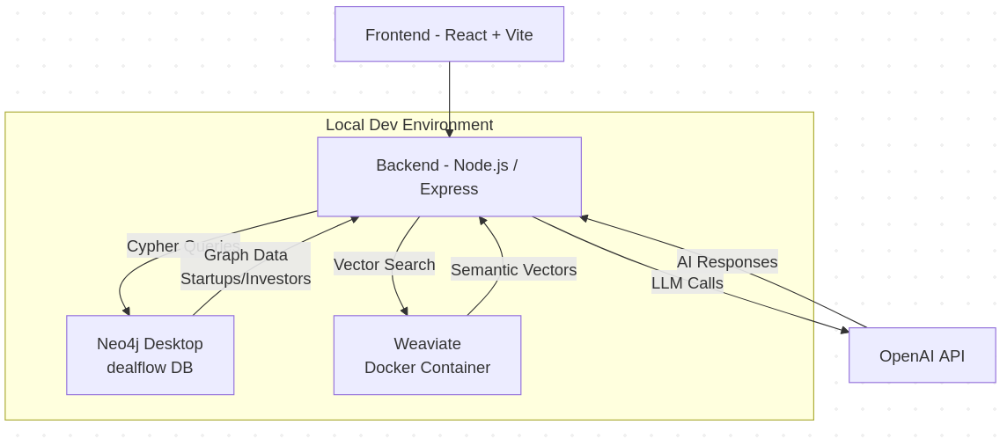
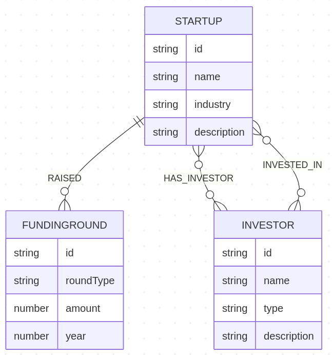
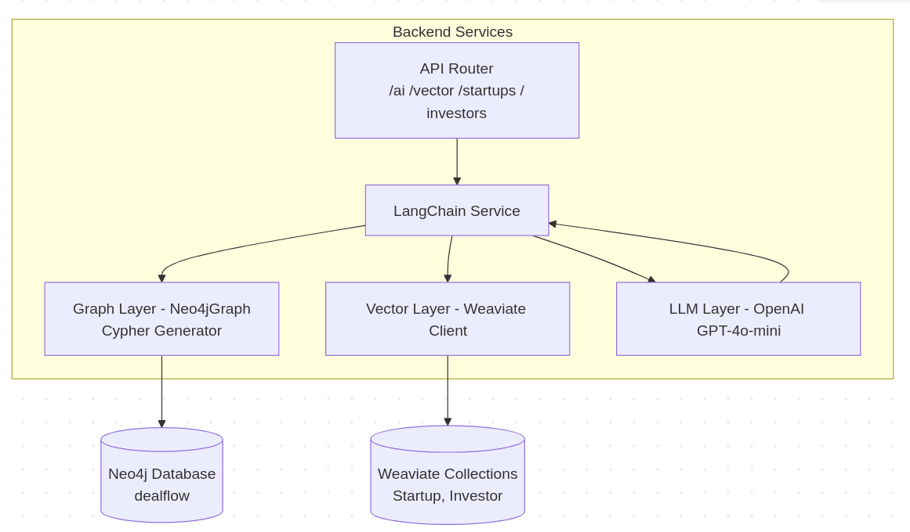
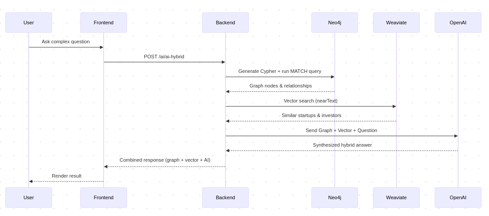

# Technical Design

## 1. Overview
The Dealflow Data Platform includes **Neo4j (graph database)** and **Weaviate (vector database)** to support:

- Graph queries (relationships, paths)
- Vector similarity (semantic search)
- Hybrid search (BM25 + vector)
- Combined graph–vector RAG responses (LangChain)
- A unified backend integrating both databases into a single API powering the React frontend and optional AI sandbox interfaces (Gradio / Chainlit)

---

## 2. Architecture

<!-- 🚀 1. High-Level System Architecture (Frontend + Backend + Databases) -->



### Components

- **Frontend (React + TypeScript)**  
  Interface for startups, investors, and AI-based interactions.

- **Backend (Express.js)**  
  - REST API endpoints such as `/startups`, `/investors`, `/search`, `/ai-query`
  - Connects to Neo4j and Weaviate
  - Business logic implemented in the `services/` layer

- **Database: Neo4j (Graph DB)**  
  - Stores startups, investors, and funding rounds as a connected graph  
  - Optimized for relationship queries and complex traversals

- **Vector Database: Weaviate**  
  - Stores embeddings for semantic similarity search  
  - Supports hybrid queries (BM25 + vector)

- **AI Layer (LangChain + OpenAI)**  
  - Translates natural language questions into Cypher queries  
  - Performs semantic search and hybrid retrieval  
  - Generates structured answers

---

## 3. Data Model

<!-- 🔎 4. Detailed Neo4j Data Model (Your dealflow graph) -->

### Node Labels

- **Startup**
  - Properties: `id`, `name`, `industry`, `foundedYear`

- **Investor**
  - Properties: `id`, `name`, `type`, `location`

- **FundingRound**
  - Properties: `id`, `roundType`, `amount`, `year`

### Relationships

- `(Startup)-[:RAISED]->(FundingRound)`
- `(Investor)-[:INVESTED_IN]->(FundingRound)`
- `(Startup)-[:HAS_INVESTOR]->(Investor)`



---

### Weaviate (Vector Schema)

- **Startup**
  - `name` (text)  
  - `industry` (text)  
  - `description` (text)  
  - Vector auto-generated using **OpenAI text-embedding-3-small**

- **Investor**
  - `name`  
  - `type`  
  - `description`  
  - Vector auto-generated  

---

## 4. Backend Modules

```bash
backend/
├── services/
│   ├── neo4jService.js
│   ├── weaviateService.js     <-- NEW (Phase 2)
│   ├── hybridSearchService.js <-- NEW
│
├── routes/
│   ├── search.routes.js       <-- NEW (semantic + hybrid)
│   ├── startups.routes.js
│   ├── investors.routes.js
│
├── ai/
│   ├── langchain/
│   │   ├── fusionPipeline.js  <-- NEW (graph + vector RAG)
│   │   ├── cypherLLM.js
│
└── ingest/
    ├── weaviateIngest.js      <-- NEW (Phase 2 ingestion)
```

### Directory Summary

- **routes/**
  - Defines REST endpoints

- **services/**
  - Contains business logic and Cypher queries

- **ai/**
  - LangChain integration and graph schema

- **middlewares/**
  - Error handling and shared middleware

---

## 5. Request Flow

<!-- 🔍 2. Backend Internal Architecture (Phase 2 Completed) -->

1. User sends request (`/startups`, `/investors`, or AI query).  
2. Express route triggers corresponding service.  
3. Service executes Cypher query via Neo4j driver.  
4. Response returned to client.



---

## 6. Tech Stack

- **Frontend:** React + TypeScript (GCP deployment)
- **Backend:** Node.js (Express.js) (GCP deployment)
- **Database:**  
  - Neo4j Aura Free Tier or Neo4j Desktop  
  - Weaviate Docker (vector DB)
- **AI Layer:** LangChain + OpenAI  
- **Deployment:** Google Cloud Run (containerized backend)

---

## 7. Weaviate Usage

| Category             | Details                          |
|----------------------|----------------------------------|
| **Module**           | `text2vec-openai`                |
| **Classes**          | `Startup`, `Investor`            |
| **Search Types**     | `nearText`, `nearVector`, `hybrid`, `BM25` |

---

## 8. LangChain Usage

LangChain integrates semantic reasoning, Cypher generation, and hybrid retrieval via:

- **Weaviate** → vector similarity  
- **Neo4j** → graph traversal  
- **OpenAI** → reasoning & synthesis  

---

### 8.1 Capabilities

- Natural-language → Cypher  
- Natural-language → vector search  
- Hybrid retrieval (semantic + graph + metadata)  
- Graph-aware RAG  
- Query validation  
- Multi-step reasoning for investor/startup intelligence  

---

### 8.2 Workflow Overview

<!-- 🧠 3. Hybrid AI Pipeline (Graph + Vector + LLM Reasoning) -->



---

### 8.3 Detailed Flow (Phase 2)

1. User submits natural language question  
2. Weaviate performs vector or hybrid search  
3. Neo4j retrieves graph relationships  
4. LangChain fuses both retrievals  
5. Backend returns combined semantic + graph result  

---

### 8.4 Example Query

**User Question:**  
> Which investors participated in Series A fintech startups similar to Stripe?

**Backend Process:**

- Weaviate → find similar startups  
- Neo4j → fetch Series A investors  
- LangChain → merge & summarize  

**Generated Cypher Example:**

```cypher
MATCH (s:Startup {industry:'Fintech'})-[:RAISED]->(f:FundingRound {roundType:'Series A'})
MATCH (i:Investor)-[:INVESTED_IN]->(f)
RETURN DISTINCT s.name, i.name;
```

---

## 9. Non-Functional Considerations

### Scalability
- Cloud Run autoscaling  
- Managed Neo4j Aura clusters  
- Weaviate sharding + replication  

### Performance
- HNSW indexing for Weaviate  
- Neo4j indexes on key properties  
- Optional backend caching  

### Cost
- Local Weaviate = free  
- Neo4j Aura Free Tier  
- Cloud Run Free Tier  
- Pay-per-use OpenAI  

### Reliability
- Persistent volumes for vector index  
- Neo4j Aura automated backups  

### Portability
- Fully containerized  
- Works on Docker, Cloud Run, GKE, ECS, EC2  

### Extensibility
- Add new vector classes  
- Extend Neo4j schema easily  

### Security
- Env-based secrets  
- TLS enforced  
- Rate limiting possible  

### Data Consistency
- Coordinated ingestion between Neo4j + Weaviate  

### Observability
- Weaviate readiness endpoints  
- Cloud Run logs  
- Neo4j metrics  

---

## 10. License & Acknowledgements

- Licensed under **MIT License**  
- Uses open-source technologies:
  - Weaviate (BSD-3-Clause)
  - LangChain (MIT)
  - Neo4j (GPLv3 CE / Commercial)
  - React (MIT)
  - Node.js (MIT)
  - Docker (Apache 2.0)
  - OpenAI APIs (Proprietary)
