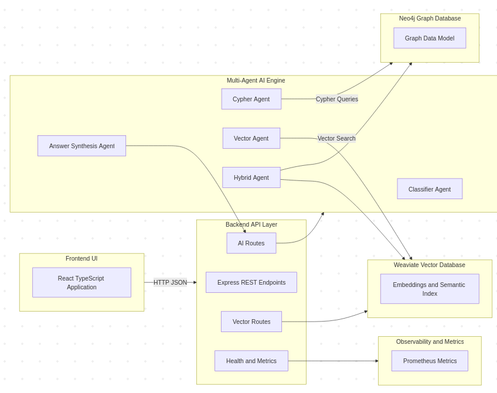
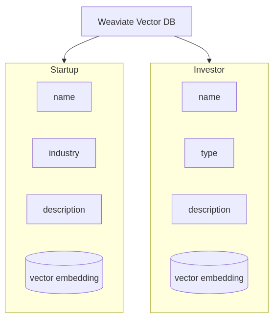
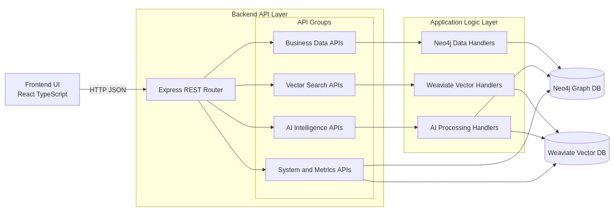
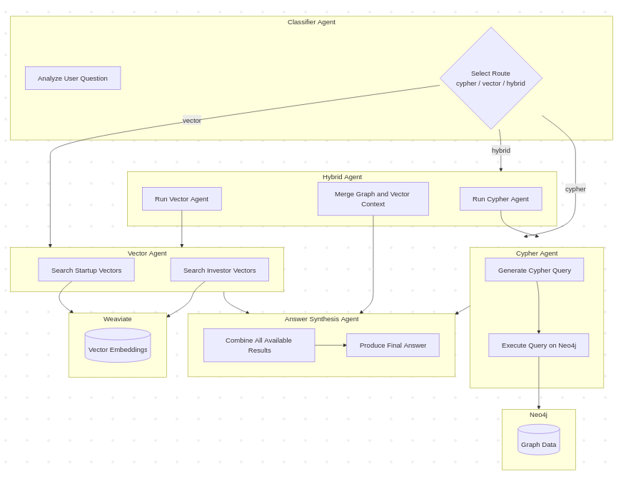
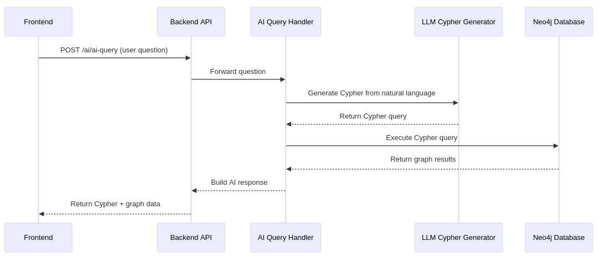
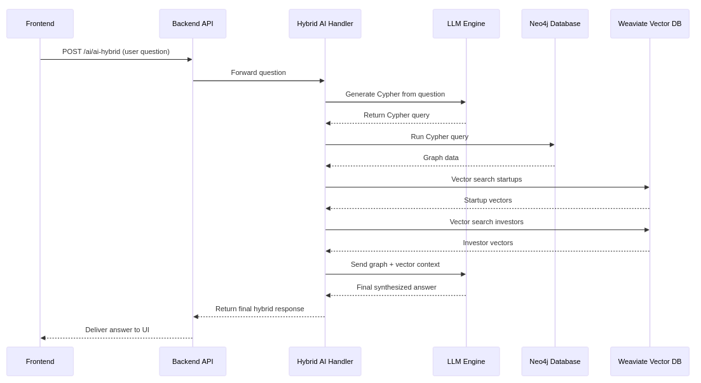
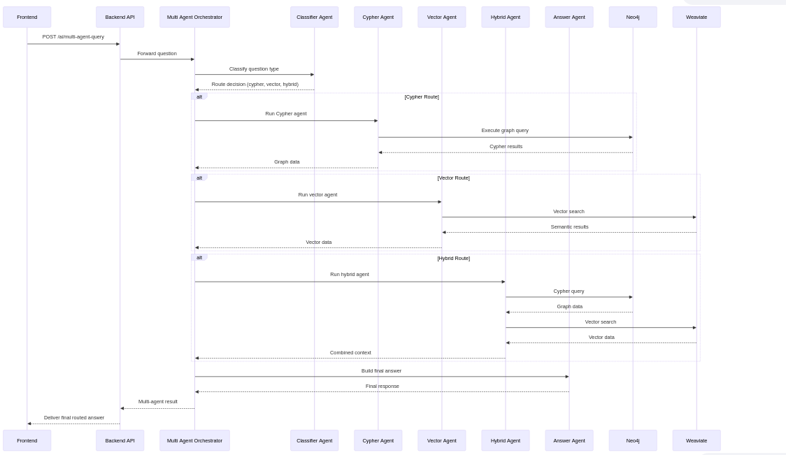
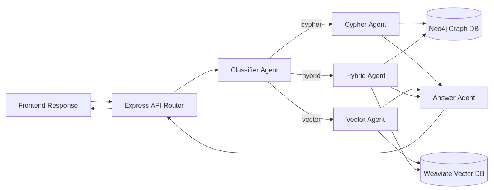
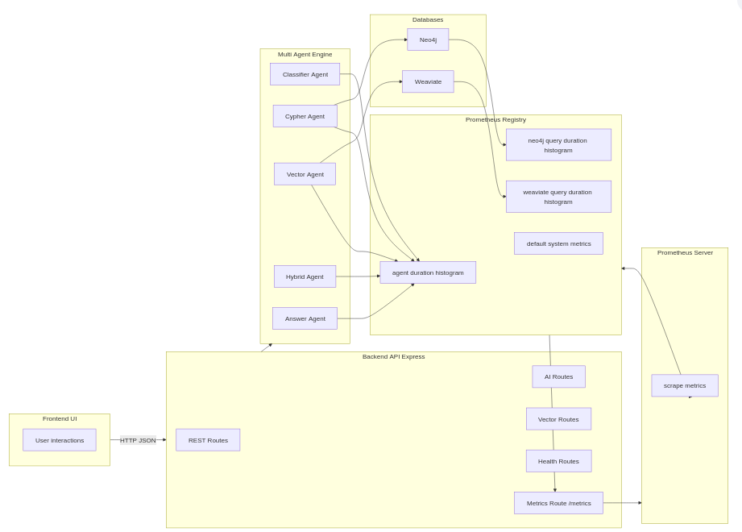

# Technical Design

## 1. Overview
The Dealflow Data Platform combines **Neo4j (graph database)**, **Weaviate (vector database)**, and **LangChain-based AI agents** to support:

- Graph queries (relationships, paths)
- Vector semantic search (nearText, HNSW)
- Hybrid graph + vector reasoning
- Multi-agent workflows with routing logic (Phase 3)
- Production observability via Prometheus
- Full-stack architecture with React + Node.js backend

---

## 2. System Architecture (Phase 3 Updated)

<!-- Placeholder: Phase 3 High-Level System Architecture -->

### Components

- **Frontend (React + TypeScript)**  
  Modern UI for browsing startups/investors and invoking AI queries.

- **Backend (Express.js)**  
  - REST routes (`/startups`, `/investors`, `/vector`, `/ai/*`)
  - Integrated Neo4j + Weaviate drivers
  - AI router for multi-agent execution

- **Multi-Agent Layer (LangChain)**  
  - Classifier agent (cypher | vector | hybrid)
  - Cypher agent → Neo4j
  - Vector agent → Weaviate
  - Hybrid agent → parallel execution
  - Answer synthesis agent

- **Databases**
  - **Neo4j** for graph queries  
  - **Weaviate** for vector semantic search

- **Metrics & Observability**
  - Prometheus histograms  
  - Agent timings  
  - Query latency metrics

---

## 3. Data Model — Neo4j Graph Schema

<!-- Placeholder: Neo4j Graph Model Diagram -->

### Node Labels
- **Startup**: `name`, `industry`, `foundedYear`
- **Investor**: `name`, `type`, `location`
- **FundingRound**: `roundType`, `amount`, `year`

### Relationships
- `(Startup)-[:RAISED]->(FundingRound)`
- `(Investor)-[:INVESTED_IN]->(FundingRound)`
- `(Startup)-[:HAS_INVESTOR]->(Investor)`

---

## 4. Vector Database Schema — Weaviate

<!-- Placeholder: Weaviate Schema Diagram -->

Two classes:
- **Startup** → `name`, `industry`, `description`, vector
- **Investor** → `name`, `type`, `description`, vector

Uses **text2vec-openai** embedding module.

---

## 5. Backend Internal Architecture (Phase 3)

<!-- Placeholder: Backend API Architecture -->

### Key Modules
- `routes/` → Express routes  
- `services/` → Neo4j + Weaviate handlers  
- `ai/` → LangChain agents + multi-agent engine  
- `metrics/` → Prometheus instrumentation  

---

## 6. Multi-Agent AI Workflow (Phase 3)

<!-- Placeholder: Multi-Agent Workflow Diagram -->

### Workflow Summary
1. **Classifier Agent**  
   Determines route: cypher / vector / hybrid.
2. **Cypher Agent**  
   Generates Cypher via LLM → Executes on Neo4j.
3. **Vector Agent**  
   Performs nearText search on Weaviate.
4. **Hybrid Agent**  
   Runs both agents → merges context.
5. **Answer Agent**  
   Synthesizes final content with explanation.

---

## 7. Sequence Diagrams (Phase 3)

### 7.1 AI Query (Graph → Cypher → Neo4j)

<!-- Placeholder: AI Query Sequence Diagram -->

---

### 7.2 Hybrid AI (Graph + Vector + Synthesis)

<!-- Placeholder: Hybrid AI Sequence Diagram -->

---

### 7.3 Multi-Agent (Classifier → Agents → Answer)

<!-- Placeholder: Multi-Agent Sequence Diagram -->

---

## 8. Request Flow

<!-- Placeholder: Request Flow Diagram -->

1. Frontend → Backend (HTTP JSON)
2. Backend → Multi-Agent Engine
3. Agent → Neo4j / Weaviate
4. Answer → Backend → Frontend

---

## 9. Metrics & Observability (Phase 3)

<!-- Placeholder: Metrics Architecture Diagram -->

Metrics implemented using **prom-client** histograms:
- `dealflow_agent_duration_seconds`
- `dealflow_neo4j_query_seconds`
- `dealflow_weaviate_query_seconds`

Plus default CPU, memory, event loop metrics.

---

## 10. Phase 4 (Planned)

**Agentic AI Enhancements**  
- Add stateful agents with memory  
- LangGraph-style nodes for reasoning  
- Add new tools: Redis cache, Aggregator agent  
- Streaming LLM responses (SSE)  
- Context caching for repeated queries  

---

## 11. Phase 5 (Final Deployment)

**Production Cloud Architecture**  
- Deploy backend on **GCP Cloud Run**  
- Serve frontend via **Cloud Storage + CDN**  
- Use **Cloud Build CI/CD**  
- Managed Neo4j Aura + Weaviate Cloud  
- Full observability with Grafana dashboards  

---

## 12. Acknowledgements
Open-source tools: Neo4j, Weaviate, LangChain, React, Node.js.

