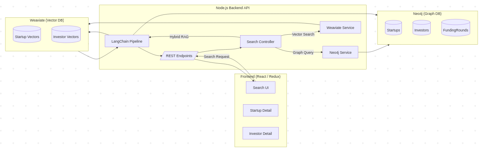
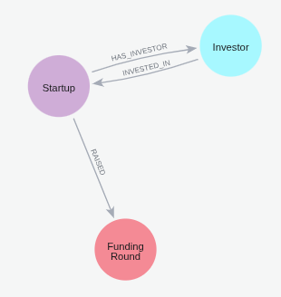
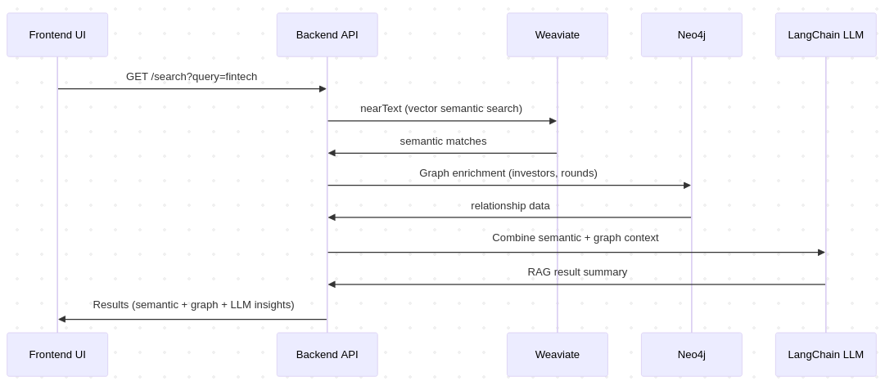
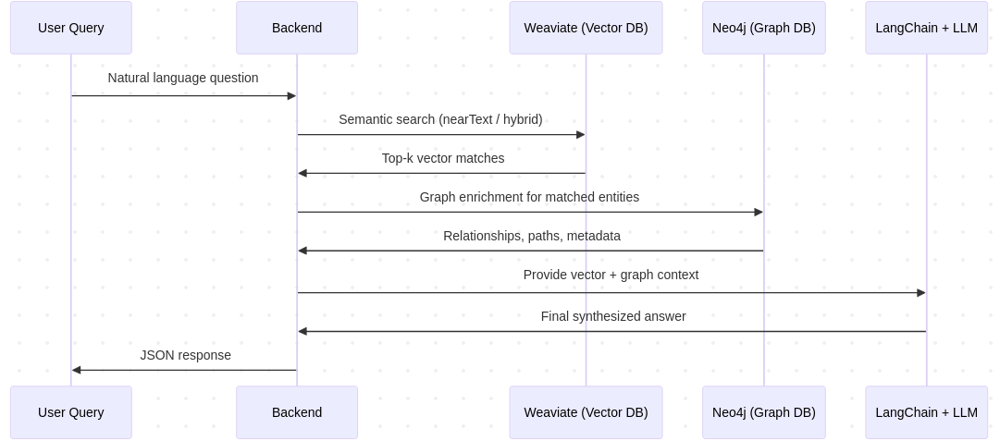

# Technical Design

## 1. Overview
The Dealflow Data Platform now includes Neo4j (graph database) and Weaviate (vector database) to support:

- Graph queries (relationships, paths)
- Vector similarity (semantic search)
- Hybrid search (BM25 + vector)
- Combined graph–vector RAG responses (LangChain)
- The backend integrates both DBs into a unified API powering the React frontend and optional AI sandbox interfaces (Gradio / Chainlit).

---

## 2. Architecture



### Components
- **Frontend (planned)**  
  - React + TypeScript for user interface  

- **Backend (Express.js)**  
  - REST API endpoints (`/startups`, `/investors`, `/search`, `/ai-query`)  
  - Connects to Neo4j database  
  - Business logic in `services/` layer  

- **Database (Neo4j)**  
  - Stores startups, investors, and funding rounds as a connected graph  
  - Optimized for relationship queries  

- **AI Layer (LangChain + OpenAI)**  
  - Translates natural language questions into Cypher queries  
  - Executes against Neo4j and returns structured answers  

---

## 3. Data Model

### Node Labels
- **Startup**
  - Properties: `id`, `name`, `industry`, `foundedYear`
- **Investor**
  - Properties: `id`, `name`, `type`, `location`
- **FundingRound**
  - Properties: `id`, `roundType`, `amount`, `year`

### Relationships
- `(Startup)-[:RAISED]->(FundingRound)`
- `(Investor)-[:INVESTED_IN]->(FundingRound)`



### Weaviate (Vector)

- **New classes**:
  - Startup
    name (text)
      industry (text)
    description (text)
    vector (auto-generated using OpenAI model text-embedding-3-small)

  - Investor
    name
    type
    description
    vector (auto-generated)
---

## 4. Backend Modules
```bash
backend/
├── services/
│   ├── neo4jService.js
│   ├── weaviateService.js     <-- NEW (Phase 2)
│   ├── hybridSearchService.js <-- NEW
│
├── routes/
│   ├── search.routes.js       <-- NEW (semantic + hybrid)
│   ├── startups.routes.js
│   ├── investors.routes.js
│
├── ai/
│   ├── langchain/
│   │   ├── fusionPipeline.js  <-- NEW (graph + vector RAG)
│   │   ├── cypherLLM.js
│
└── ingest/
    ├── weaviateIngest.js      <-- NEW (Phase 2 ingestion)

```

- **routes/**  
  Defines REST endpoints (`/startups`, `/investors`, `/search`).  

- **services/**  
  Contains business logic and Cypher queries (e.g., `startupService.js`, `investorService.js`).  

- **ai/**  
  Dedicated LangChain integration (`langchainService.js`) + schema for Cypher generation.  

- **middlewares/**  
  Common middleware such as error handling.  

---

## 5. Request Flow

1. User sends request (`/startups` or AI query).  
2. Express route calls corresponding service.  
3. Service executes Cypher query via Neo4j driver.  
4. Results returned to client.  


---
## 6. Tech Stack 
- **Frontend:** React + TypeScript tested and deployed on GCP free tier
- **Backend:** Node.js with Express.js  tested and deployed on GCP free tier
- **Database:** 
      Neo4j Aura Free Tier (cloud) or Neo4j Desktop
      Weaviate docker setup  (vector)
- **AI Layer:** LangChain + OpenAI (Cypher query generation)  
- **Deployment:** Google Cloud Run (containerized backend)  

---


## 7. Weaviate Usage

| Category             | Details                          |
|----------------------|----------------------------------|
| **Module**           | `text2vec-openai`               |
| **Classes (Schema)** | `Startup`, `Investor`           |
| **Search Types**     | `nearText`, `nearVector`, `hybrid`, `BM25` |

 ---


## 8. LangChain Usage

LangChain is integrated into the backend to power **semantic reasoning**,  
**Cypher query generation**, and **hybrid RAG retrieval** by combining:

- **Weaviate** → vector similarity search  
- **Neo4j** → graph traversal  
- **OpenAI LLMs** → reasoning + answer synthesis  

---

### **8.1 Capabilities Enabled by LangChain**
- Natural-language → Cypher conversion  
- Natural-language → vector search query  
- Graph-aware RAG (LLM uses Neo4j paths + Weaviate vectors)  
- Hybrid retrieval (semantic + graph + metadata)  
- Query validation & sanitization  
- Multi-step reasoning for investor/startup intelligence  

---

## **8.2 Workflow Overview**



---

### **8.3 Detailed Flow (Phase 2)**

1. **User submits natural language question**  
   Example:  
   _"Which fintech startups are similar to Stripe?"_

2. **Vector Search (Weaviate)**  
   The backend performs:
   - `nearText` (semantic)
   - or `hybrid` (BM25 + vector fusion)

3. **Graph Traversal (Neo4j)**  
   For the matched startups/investors, Neo4j is queried for:
   - relationships  
   - funding history  
   - shared investors  
   - ecosystem graph context  

4. **LangChain Fusion**  
   LangChain merges:
   - semantic search results  
   - graph traversal results  
   - user question  
   - system-level prompts  

   The LLM produces a structured explanation or summary.

5. **Return Combined Result**  
   Backend returns:
   - vector matches  
   - graph metadata  
   - LLM-generated reasoning  

---

### **8.4 Example Query (Phase 2)**

**User Question:**  
> "Which investors participated in Series A fintech startups similar to Stripe?"

**Backend Process:**
- Weaviate → find startups similar to “Stripe”  
- Neo4j → retrieve investors involved in Series A rounds  
- LangChain → merge results + generate final summary  

**Example Cypher generated by LangChain:**

```cypher
MATCH (s:Startup {industry:'Fintech'})-[:RAISED]->(f:FundingRound {roundType:'Series A'})
MATCH (i:Investor)-[:INVESTED_IN]->(f)
RETURN DISTINCT s.name, i.name;


## 9. Non-Functional Considerations  

### **Scalability**
- Cloud Run autoscaling handles REST API load automatically.  
- Weaviate supports horizontal scaling (sharding + replication) when moving beyond local Docker.  
- Neo4j Aura provides managed high-availability clusters for graph workloads.  
- Vector search scales with HNSW index configuration (ef, maxConnections).

### **Performance**
- Vector queries (`nearText`, `hybrid`) use HNSW indexing for millisecond retrieval.  
- Graph traversal performance depends on index usage (`CREATE INDEX` on key properties).  
- Backend caches frequent queries (optional in future phases).  
- OpenAI embeddings cached locally to reduce repeated cost and latency.

### **Cost**
- Local Weaviate = free.  
- Neo4j Aura Free Tier for graph.  
- Cloud Run free tier for backend hosting.  
- OpenAI embedding + LLM usage only billed per request.  
- Hybrid search reduces overuse of LLM calls by retrieving relevant context first.

### **Reliability**
- Weaviate vector index stored on persistent volume (`services/data/weaviate`).  
- Neo4j Aura provides automated backups and fault tolerance.  
- Docker local setup provides deterministic reproducibility for development.

### **Portability**
- Entire system is containerized and runs on:  
  - Local machine (Docker)  
  - Cloud Run  
  - GCP GKE  
  - AWS ECS / EC2  
  - Any infrastructure that supports Docker Compose  
- Codebase uses environment-based configuration for portability.

### **Extensibility**
- Easy to add new vector-enabled classes (e.g., `Accelerator`, `Advisor`, `Founder`).  
- Graph schema can be extended with new relationships without breaking existing queries.  
- Backend supports modular `services/` pattern to add new vector or graph operations.

### **Security**
- API keys (OpenAI) and DB credentials stored in environment variables or Secret Manager.  
- Weaviate anonymous access is allowed only in local dev; production requires API key or OIDC.  
- HTTPS is enforced at Cloud Run level.  
- Neo4j Aura uses encrypted `neo4j+s://` connections.  
- No secrets stored in Git — fully environment-driven.  
- DOS/abuse protection possible at Cloud Run (rate limiting, IAM).  

### **Data Consistency**
- Vector DB (Weaviate) and Graph DB (Neo4j) are eventually consistent.  
- Ingestion scripts ensure data is inserted in both systems in a coordinated manner.  
- Future Phase: add background sync job to validate consistency.

### **Observability**
- Weaviate provides `/v1/.well-known/ready` and `/v1/.well-known/live`.  
- Cloud Run logs available in GCP Logging.  
- Neo4j Aura provides Health & Query monitoring.  
- Optional: integrate Prometheus/Grafana (Phase 3).


---

## 10. License & Acknowledgements  
- Licensed under [MIT License](./LICENSE).  

- This project acknowledges the contributions of the following open-source technologies and frameworks:

  - **Weaviate** (BSD-3-Clause License)  
    - https://github.com/weaviate/weaviate  
    - Used for vector search, hybrid search, and embedding storage.  

  - **LangChain** (MIT License)  
    - Framework for LLM orchestration and RAG pipelines.  

  - **Neo4j** (GPLv3 Community Edition / Commercial Enterprise)  
    - Graph database for relationship intelligence and analytics.  

  - **React** (MIT License)  
    - Frontend UI framework.

  - **Node.js** (MIT License)  
    - Backend runtime environment.

  - **Docker** (Apache 2.0 License)  
    - Containerization platform for local development and deployment.

  - **OpenAI Models** (Proprietary — API usage license)  
    - Used for embeddings, reasoning, and generative responses.


