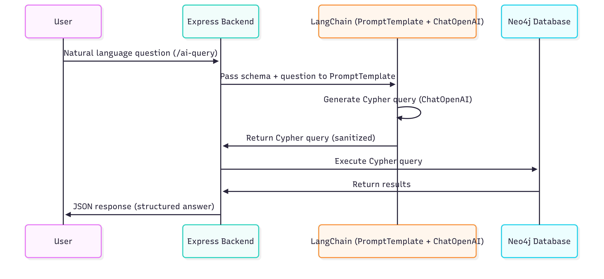

# Technical Design

## 1. Overview
The Dealflow Data Platform provides a graph-based solution to manage **startups, investors, and funding rounds**.  
It combines **Neo4j** as the database, **Express.js** as the backend service layer, and an optional **AI service** powered by LangChain for natural language to Cypher query translation.

---

## 2. Architecture


### Components
- **Frontend (planned)**  
  - React + TypeScript for user interface  

- **Backend (Express.js)**  
  - REST API endpoints (`/startups`, `/investors`, `/search`, `/ai-query`)  
  - Connects to Neo4j database  
  - Business logic in `services/` layer  

- **Database (Neo4j)**  
  - Stores startups, investors, and funding rounds as a connected graph  
  - Optimized for relationship queries  

- **AI Layer (LangChain + OpenAI)**  
  - Translates natural language questions into Cypher queries  
  - Executes against Neo4j and returns structured answers  

---

## 3. Data Model

### Node Labels
- **Startup**
  - Properties: `id`, `name`, `industry`, `foundedYear`
- **Investor**
  - Properties: `id`, `name`, `type`, `location`
- **FundingRound**
  - Properties: `id`, `roundType`, `amount`, `year`

### Relationships
- `(Startup)-[:RAISED]->(FundingRound)`
- `(Investor)-[:INVESTED_IN]->(FundingRound)`


---

## 4. Backend Modules
```bash
backend/
├── ai/
│ ├── config/ # Graph schema definition for AI queries
│ ├── routes/ # /ai-query endpoint
│ └── services/ # LangChain integration
├── config/neo4j.js # Neo4j driver setup
├── routes/ # Express route definitions
├── services/ # Startup & Investor business logic
└── middlewares/ # Error handling
```

- **routes/**  
  Defines REST endpoints (`/startups`, `/investors`, `/search`).  

- **services/**  
  Contains business logic and Cypher queries (e.g., `startupService.js`, `investorService.js`).  

- **ai/**  
  Dedicated LangChain integration (`langchainService.js`) + schema for Cypher generation.  

- **middlewares/**  
  Common middleware such as error handling.  

---

## 5. Request Flow

1. User sends request (`/startups` or AI query).  
2. Express route calls corresponding service.  
3. Service executes Cypher query via Neo4j driver.  
4. Results returned to client.  
